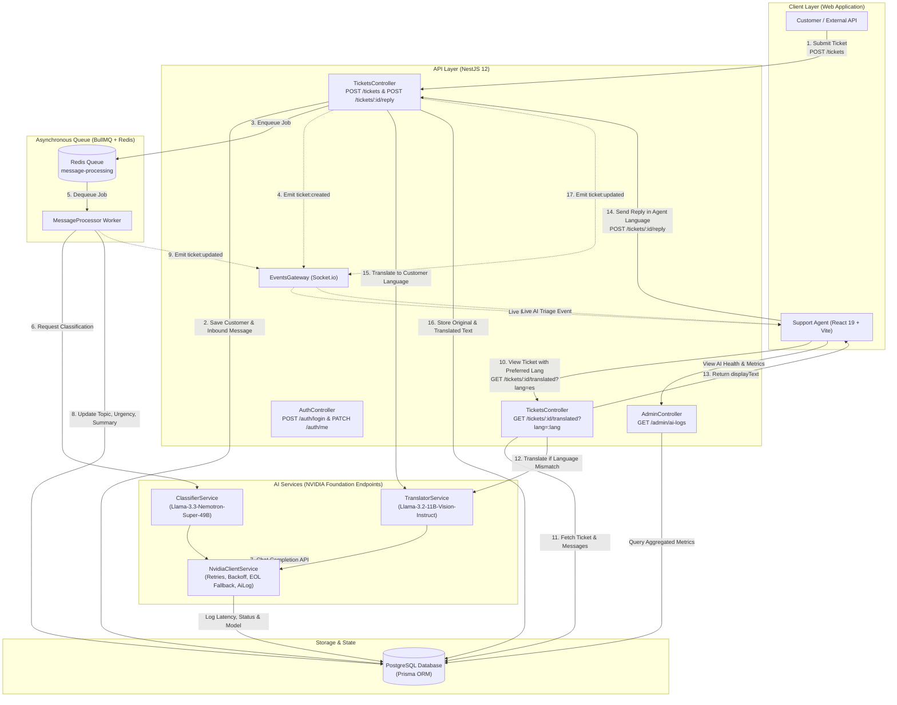

# PolyDesk Architecture & Data Flow

This document details the system architecture, component interactions, and asynchronous event flows in **PolyDesk**.

---

## High-Level Architecture Diagram

---

## Detailed Data Flows

### 1. Inbound Ticket Submission & Asynchronous AI Triage
1. **Ticket Creation**: A customer submits a ticket via `POST /tickets`.
2. **Initial Persistence**: NestJS creates the `Customer`, `Ticket` (with status `OPEN` and `aiStatus: 'pending'`), and the initial inbound `Message` in PostgreSQL.
3. **Queue Enqueue**: A job `{ ticketId, messageId }` is placed on the BullMQ queue (`message-processing`) backed by Redis.
4. **Immediate Response**: The API responds immediately to the caller and emits a `ticket:created` event over Socket.io to keep agent inboxes up to date.
5. **Background AI Processing**:
   - `MessageProcessor` picks up the job from the Redis queue.
   - It invokes `ClassifierService`, which prompts the NVIDIA Nemotron model for structured JSON output (`language`, `topic`, `urgency`, `summary`).
   - If the LLM returns invalid JSON or markdown-fenced text, it retries with a strict correction prompt before falling back to safe defaults.
   - The ticket record in PostgreSQL is updated with classified attributes and `aiStatus: 'done'`.
6. **Live Broadcast**: `EventsGateway` emits a `ticket:updated` WebSocket broadcast, instantly updating badges, topic tags, urgency levels, and AI summaries across all active agent dashboards without a page refresh.

---

### 2. On-Demand Dynamic Translation (Per-Agent Preferences)
1. When an agent opens a ticket, the frontend requests `GET /tickets/:id/translated?lang=<agent_preferred_lang>`.
2. `TicketsService.findOneTranslated` evaluates each message:
   - **Same Language Match**: If `originalLanguage === targetLang` (or both are English), `originalText` is returned directly.
   - **Stored Translation Reuse**: If a pre-translated text in that target language exists (e.g. from an outbound reply translated at submission), it is returned without making an AI API call.
   - **Dynamic Translation**: If translation is needed, `TranslatorService` translates the text into the agent's preferred language, with an automated similarity guard to prevent unchanged echoing.
3. Each message payload returns with a computed `displayText` field for display, while preserving the raw `originalText` and `originalLanguage`.

---

### 3. Outbound Agent Reply Flow
1. An agent drafts a reply in their native or preferred language (e.g., Arabic, Dutch, French) and submits via `POST /tickets/:id/reply`.
2. The server detects the customer's language (from customer profile or their first inbound message).
3. If the languages differ, `TranslatorService` automatically translates the reply into the customer's language.
4. The message is stored with:
   - `originalText`: the agent's raw typed text.
   - `originalLanguage`: the agent's language.
   - `translatedText`: the translated text for the customer.
   - `translatedLanguage`: the customer's language.
5. `EventsGateway` broadcasts the updated thread to all connected agents in real time.

---

### 4. Observability & Telemetry Logging
1. Every call routed through `NvidiaClientService` tracks latency, target model, actual fallback model used, success flag, and error messages.
2. Metrics are asynchronously written to the `AiLog` table in PostgreSQL.
3. The Admin dashboard (`GET /admin/ai-logs`) aggregates total call count, overall success rate, average latency in milliseconds, and breakdowns by task (`classify`, `translate`) and model.
